Spatial statistic
================
HyangGon Jin(<https://github.com/HyangGonJin/spatial-statistics.git>)

# 0\. Load the Packages

’ggmap’의 경우 아래 코드를 실행하여 설치를 해야합니다.

``` r
if(!requireNamespace("devtools")) install.packages("devtools")
devtools::install_github("dkahle/ggmap")
```

GCP api 키 발급 링크 : <https://cloud.google.com/maps-platform/>

``` r
suppressPackageStartupMessages({
  library(dplyr)
  library(reshape2)
  library(GISTools)
  library(ggmap)
  library(rgdal)
  library(maptools)
  library(gstat)
  library(sp)
})

register_google(key='my-key')
```

# 1\. ggplot + ggmap

### Load the data.

``` r
wifi = read.csv("/Users/hyanggonjin/Downloads/spatial/서울시_공공와이파이.csv",header=T,
                fileEncoding="euc-kr")
colnames(wifi) = c("gu","type","zone","lon","lat","comp")
wifi %>% summary
```

    ##       gu                type               zone                lon       
    ##  Length:2992        Length:2992        Length:2992        Min.   :126.8  
    ##  Class :character   Class :character   Class :character   1st Qu.:126.9  
    ##  Mode  :character   Mode  :character   Mode  :character   Median :127.0  
    ##                                                           Mean   :127.0  
    ##                                                           3rd Qu.:127.0  
    ##                                                           Max.   :127.2  
    ##                                                           NA's   :6      
    ##       lat            comp          
    ##  Min.   :37.42   Length:2992       
    ##  1st Qu.:37.51   Class :character  
    ##  Median :37.55   Mode  :character  
    ##  Mean   :37.55                     
    ##  3rd Qu.:37.58                     
    ##  Max.   :37.87                     
    ##  NA's   :6

``` r
wifi1 = wifi %>% na.omit
wifi1 %>% summary
```

    ##       gu                type               zone                lon       
    ##  Length:2986        Length:2986        Length:2986        Min.   :126.8  
    ##  Class :character   Class :character   Class :character   1st Qu.:126.9  
    ##  Mode  :character   Mode  :character   Mode  :character   Median :127.0  
    ##                                                           Mean   :127.0  
    ##                                                           3rd Qu.:127.0  
    ##                                                           Max.   :127.2  
    ##       lat            comp          
    ##  Min.   :37.42   Length:2986       
    ##  1st Qu.:37.51   Class :character  
    ##  Median :37.55   Mode  :character  
    ##  Mean   :37.55                     
    ##  3rd Qu.:37.58                     
    ##  Max.   :37.87

### get\_map()

``` r
x1.ln=wifi1$lon
x2.lt=wifi1$lat
x1r = range(x1.ln)
x2r = range(x2.lt)
mylocation=c(x1r[1]+.02,x2r[1]-.08,x1r[2]+.02,x2r[2]-.08)
myMap <- get_map(location=mylocation, source="google", maptype="roadmap",zoom=11,color="bw") 
```

    ## Source : http://tile.stamen.com/terrain/11/1745/791.png

    ## Source : http://tile.stamen.com/terrain/11/1746/791.png

    ## Source : http://tile.stamen.com/terrain/11/1747/791.png

    ## Source : http://tile.stamen.com/terrain/11/1745/792.png

    ## Source : http://tile.stamen.com/terrain/11/1746/792.png

    ## Source : http://tile.stamen.com/terrain/11/1747/792.png

    ## Source : http://tile.stamen.com/terrain/11/1745/793.png

    ## Source : http://tile.stamen.com/terrain/11/1746/793.png

    ## Source : http://tile.stamen.com/terrain/11/1747/793.png

    ## Source : http://tile.stamen.com/terrain/11/1745/794.png

    ## Source : http://tile.stamen.com/terrain/11/1746/794.png

    ## Source : http://tile.stamen.com/terrain/11/1747/794.png

``` r
#maptype : stamen, hybrid, roadmap, terrain, satellite
ggmap(myMap)
```

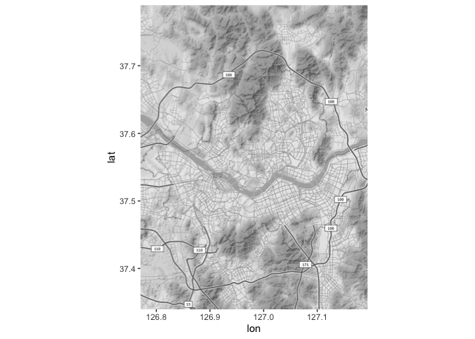<!-- -->

### geom\_point()

``` r
theme_set(theme_grey(base_family='NanumGothic'))

ggmap(myMap) + geom_point(aes(x = lon, y = lat, colour=gu), 
                         data = wifi1, alpha = .5, size = 2,shape=3) + coord_equal() 
```

    ## Coordinate system already present. Adding new coordinate system, which will replace the existing one.

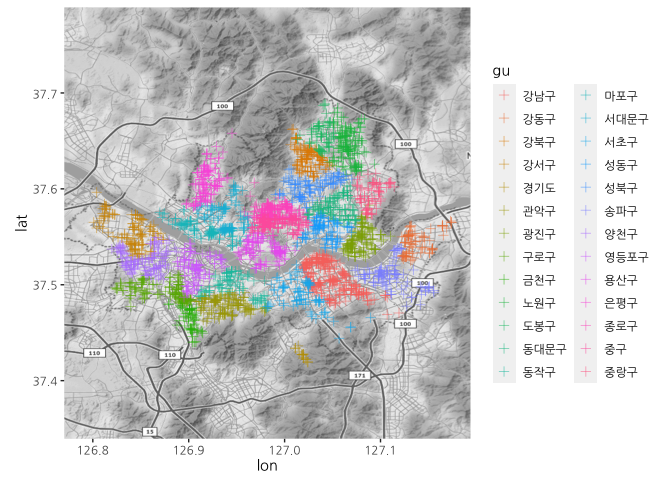<!-- -->

### geom\_point + stat\_density\_2d

``` r
ggmap(myMap) + stat_density_2d(aes(fill=..level..),geom="polygon", data = wifi1, alpha = .2, size = 1) +
  geom_point(aes(x=lon,y=lat),data=wifi1,alpha=0.4,color="black",size=0.5) +
  coord_equal() + scale_fill_continuous(low = "lightseagreen",high="tomato",name="Density")
```

    ## Coordinate system already present. Adding new coordinate system, which will replace the existing one.

    ## Warning: Removed 2 rows containing non-finite values (stat_density2d).

    ## Warning: Removed 2 rows containing missing values (geom_point).

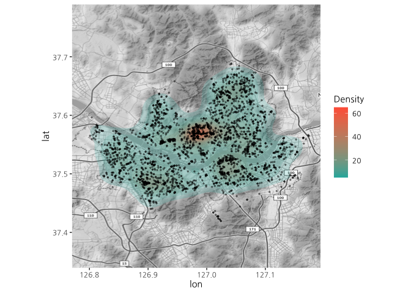<!-- -->

### facet\_wrap(); with the group variables

``` r
wifi2=wifi1[wifi1$comp==c("KT","LGU+","SKT"),]
```

    ## Warning in wifi1$comp == c("KT", "LGU+", "SKT"): 두 객체의 길이가 서로 배수관계
    ## 에 있지 않습니다

``` r
telecom = c("KT","LGU+","SKT")
wifi2 = wifi1 %>% filter(comp %in% telecom) 
ggmap(myMap) + stat_density_2d(aes(fill=..level..),geom="polygon", data = wifi2, alpha = .2, size = 1) +
  geom_point(aes(x=lon,y=lat),data=wifi2,alpha=0.4,color="black",size=0.5) +
  scale_fill_continuous(low = "lightseagreen",high="tomato",name="Density") + facet_wrap(~comp,ncol=3)
```

    ## Warning: Removed 2 rows containing non-finite values (stat_density2d).

    ## Warning: Removed 2 rows containing missing values (geom_point).

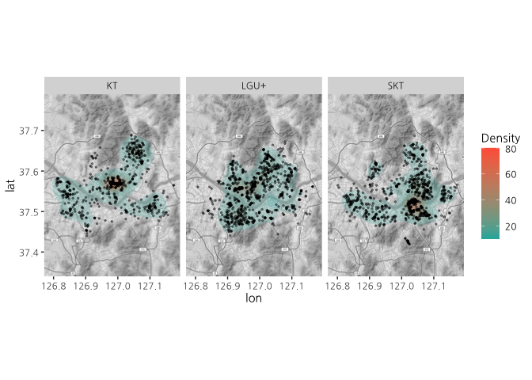<!-- -->

# 2\. geom\_polygon()

``` r
filepath = "/Users/hyanggonjin/Downloads/spatial/SIG_201703/TL_SCCO_SIG.shp"
area = readOGR(filepath,encoding="euc-kr")
```

    ## Warning in OGRSpatialRef(dsn, layer, morphFromESRI = morphFromESRI, dumpSRS
    ## = dumpSRS, : Discarded datum International_Terrestrial_Reference_Frame_2000
    ## in CRS definition: +proj=tmerc +lat_0=38 +lon_0=127.5 +k=0.9996 +x_0=1000000
    ## +y_0=2000000 +ellps=GRS80 +units=m +no_defs

    ## OGR data source with driver: ESRI Shapefile 
    ## Source: "/Users/hyanggonjin/Downloads/spatial/SIG_201703/TL_SCCO_SIG.shp", layer: "TL_SCCO_SIG"
    ## with 250 features
    ## It has 3 fields

``` r
area1 = subset(area, subset = (substr(area$SIG_CD,1,2) == "11")) %>% fortify(region="SIG_KOR_NM")
```

    ## Warning in RGEOSUnaryPredFunc(spgeom, byid, "rgeos_isvalid"): Ring Self-
    ## intersection at or near point 937970.58015373 1951945.3702855001

    ## SpP is invalid

    ## Warning in rgeos::gUnaryUnion(spgeom = SpP, id = IDs): Invalid objects found;
    ## consider using set_RGEOS_CheckValidity(2L)

``` r
area11 = area1 %>% filter(id!="강서구")

area2 = subset(area, subset = (substr(area$SIG_CD,1,4) == "1150")) %>% fortify(region="SIG_KOR_NM")
```

    ## Warning in RGEOSUnaryPredFunc(spgeom, byid, "rgeos_isvalid"): Ring Self-
    ## intersection at or near point 937970.58015373 1951945.3702855001

    ## SpP is invalid

    ## Warning in rgeos::gUnaryUnion(spgeom = SpP, id = IDs): Invalid objects found;
    ## consider using set_RGEOS_CheckValidity(2L)

``` r
area21 = area2[-((nrow(area2)-143):nrow(area2)),]

area3=rbind(area11,area21)

dat=as.data.frame(table(wifi$gu))
colnames(dat)=c("id","Freq")
wifi3=merge(area3,dat,by="id")
ggplot(data = wifi3, aes(x = long, y = lat, group = id))+
  geom_polygon(aes(fill = Freq)) + theme_bw() + geom_path() + 
  scale_fill_continuous(low="powder blue", high ="tomato", name="Freq")
```

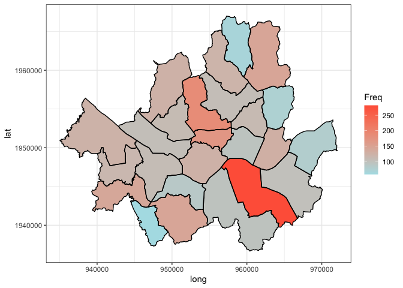<!-- -->

``` r
lat=aggregate(lat~id,wifi3,mean)
long=aggregate(long~id,wifi3,mean)
centroid=merge(lat,long)
centroid[12,2]<-centroid[12,2]+1000
centroid[7,3]<-centroid[7,3]-1000
centroid[16,3]<-centroid[16,3]+1000
centroid[2,3]<-centroid[2,3]-1000
centroid[15,2]<-centroid[15,2]+1000

theme_set(theme_grey(base_family='NanumGothic'))

ggplot(data = wifi3, aes(x = long, y = lat, group = id))+
  geom_polygon(aes(fill = Freq)) + geom_path() +
  scale_fill_continuous(low="powder blue", high ="tomato", name="Freq") +
  theme_minimal() + geom_text(aes(label=id,x=long,y=lat),data=centroid)
```

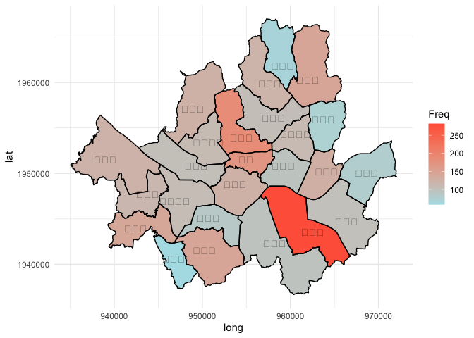<!-- -->

# 3\. Real data analysis

### Load the data

``` r
data1=read.csv("/Users/hyanggonjin/Downloads/spatial/spatial.csv",header=T,
                fileEncoding="euc-kr")
summary(data1)
```

    ##      sido             sigungu              eub                 LON       
    ##  Length:9147        Length:9147        Length:9147        Min.   :127.9  
    ##  Class :character   Class :character   Class :character   1st Qu.:128.1  
    ##  Mode  :character   Mode  :character   Mode  :character   Median :128.1  
    ##                                                           Mean   :128.1  
    ##                                                           3rd Qu.:128.2  
    ##                                                           Max.   :128.4  
    ##       LAT              y                  x1                x2        
    ##  Min.   :35.06   Min.   :   0.242   Min.   :  8.001   Min.   :   1.0  
    ##  1st Qu.:35.16   1st Qu.:  20.496   1st Qu.: 25.514   1st Qu.:  45.0  
    ##  Median :35.19   Median :  45.375   Median : 38.729   Median : 156.0  
    ##  Mean   :35.20   Mean   : 189.046   Mean   : 49.408   Mean   : 261.6  
    ##  3rd Qu.:35.23   3rd Qu.: 128.303   3rd Qu.: 60.057   3rd Qu.: 389.0  
    ##  Max.   :35.35   Max.   :6355.932   Max.   :365.156   Max.   :2061.0  
    ##        x3             x4             x5              x6              x7       
    ##  Min.   :   1   Min.   :   1   Min.   :    0   Min.   : 0.00   Min.   :1.000  
    ##  1st Qu.: 841   1st Qu.: 745   1st Qu.: 4989   1st Qu.: 1.40   1st Qu.:4.000  
    ##  Median :2702   Median :1506   Median : 8539   Median : 6.00   Median :6.000  
    ##  Mean   :4155   Mean   :1663   Mean   : 9241   Mean   : 7.60   Mean   :4.872  
    ##  3rd Qu.:9999   3rd Qu.:2324   3rd Qu.:13226   3rd Qu.:12.37   3rd Qu.:6.000  
    ##  Max.   :9999   Max.   :9999   Max.   :21364   Max.   :32.81   Max.   :8.000

### Merge the data with id

``` r
#법정동 코드 조회: https://www.code.go.kr/index.do#
code <- read.csv("/Users/hyanggonjin/Downloads/spatial/법정동코드 조회자료/법정동코드 조회자료.csv",fileEncoding="euc-kr")
code %>% head
```

    ##           id 법정동명     si    eub
    ## 1 4817010100 경상남도 진주시 망경동
    ## 2 4817010200 경상남도 진주시 주약동
    ## 3 4817010300 경상남도 진주시 강남동
    ## 4 4817010400 경상남도 진주시 칠암동
    ## 5 4817010500 경상남도 진주시 본성동
    ## 6 4817010600 경상남도 진주시 동성동

``` r
data2 <- merge(data1,code[,c(1,4)],by="eub")
data2 %>% head
```

    ##      eub     sido sigungu      LON      LAT         y       x1  x2  x3  x4   x5
    ## 1 가좌동 경상남도  진주시 128.1197 35.14738  136.0921 39.40688 432 258 458 4892
    ## 2 가좌동 경상남도  진주시 128.1057 35.14411  129.2090 51.48160 147 269 500 4816
    ## 3 가좌동 경상남도  진주시 128.1046 35.14563  516.6667 40.00000 188  79 690 4621
    ## 4 가좌동 경상남도  진주시 128.1156 35.14881  197.0859 40.00000 303  15 157 4597
    ## 5 가좌동 경상남도  진주시 128.1094 35.16630  988.5057 20.85668 235 885 649 2614
    ## 6 가좌동 경상남도  진주시 128.1066 35.16325 2259.8870 26.16725  15 752 648 2806
    ##     x6 x7         id
    ## 1 4.76  4 4817013100
    ## 2 9.33  4 4817013100
    ## 3 1.30  4 4817013100
    ## 4 6.38  4 4817013100
    ## 5 1.33  1 4817013100
    ## 6 1.64  1 4817013100

### Regression

``` r
set.seed(1234)
ind=sample(x=2,nrow(data2),replace=T,prob=c(0.04,0.96))
traindata=data2[ind==1,]
testdata=data2[ind==2,]


traindata=transform(traindata, y_log = log(y))


fit=lm(y_log~x1+x2+x3+x4+x5+x6+factor(x7), data=traindata)
summary(fit) 
```

    ## 
    ## Call:
    ## lm(formula = y_log ~ x1 + x2 + x3 + x4 + x5 + x6 + factor(x7), 
    ##     data = traindata)
    ## 
    ## Residuals:
    ##     Min      1Q  Median      3Q     Max 
    ## -3.1666 -0.4706  0.0499  0.4843  2.4412 
    ## 
    ## Coefficients:
    ##               Estimate Std. Error t value Pr(>|t|)    
    ## (Intercept)  7.239e+00  1.886e-01  38.374  < 2e-16 ***
    ## x1          -6.157e-03  1.663e-03  -3.701 0.000249 ***
    ## x2          -3.135e-04  1.840e-04  -1.704 0.089299 .  
    ## x3          -6.404e-05  1.306e-05  -4.903 1.45e-06 ***
    ## x4           5.600e-05  3.324e-05   1.685 0.092910 .  
    ## x5          -7.439e-05  1.336e-05  -5.569 5.12e-08 ***
    ## x6          -7.049e-02  8.443e-03  -8.349 1.64e-15 ***
    ## factor(x7)2  2.522e-01  3.080e-01   0.819 0.413415    
    ## factor(x7)3 -1.416e-01  4.664e-01  -0.304 0.761684    
    ## factor(x7)4 -1.592e+00  1.875e-01  -8.491 6.01e-16 ***
    ## factor(x7)6 -1.497e+00  2.221e-01  -6.741 6.54e-11 ***
    ## factor(x7)7 -2.378e+00  2.265e-01 -10.497  < 2e-16 ***
    ## factor(x7)8 -8.254e-01  5.106e-01  -1.617 0.106878    
    ## ---
    ## Signif. codes:  0 '***' 0.001 '**' 0.01 '*' 0.05 '.' 0.1 ' ' 1
    ## 
    ## Residual standard error: 0.8528 on 348 degrees of freedom
    ## Multiple R-squared:  0.7143, Adjusted R-squared:  0.7044 
    ## F-statistic:  72.5 on 12 and 348 DF,  p-value: < 2.2e-16

``` r
#ncvTest(fit)
#shapiro.test(residuals(fit)) 


traindata$resid=residuals(fit)
```

### get\_map()

``` r
x1.ln=data2$LON
x2.lt=data2$LAT
x1r = range(x1.ln)
x2r = range(x2.lt)
mylocation=c(x1r[1],x2r[1],x1r[2],x2r[2])

myMap=get_map(location= mylocation, source="google", maptype="roadmap", crop=FALSE, zoom=11,color='bw') 
```

    ## Source : http://tile.stamen.com/terrain/11/1751/808.png

    ## Source : http://tile.stamen.com/terrain/11/1752/808.png

    ## Source : http://tile.stamen.com/terrain/11/1753/808.png

    ## Source : http://tile.stamen.com/terrain/11/1754/808.png

    ## Source : http://tile.stamen.com/terrain/11/1751/809.png

    ## Source : http://tile.stamen.com/terrain/11/1752/809.png

    ## Source : http://tile.stamen.com/terrain/11/1753/809.png

    ## Source : http://tile.stamen.com/terrain/11/1754/809.png

    ## Source : http://tile.stamen.com/terrain/11/1751/810.png

    ## Source : http://tile.stamen.com/terrain/11/1752/810.png

    ## Source : http://tile.stamen.com/terrain/11/1753/810.png

    ## Source : http://tile.stamen.com/terrain/11/1754/810.png

``` r
ggmap(myMap)
```

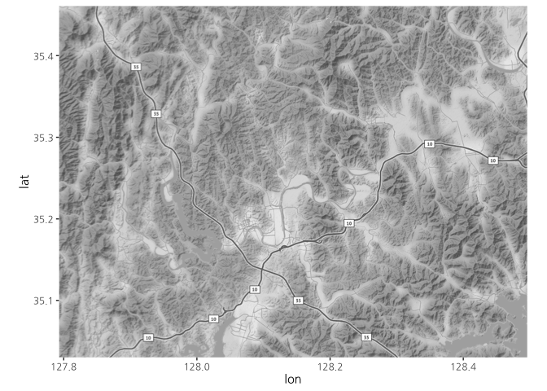<!-- -->

### Empirical variogram

``` r
coordinates(traindata) <- ~ LON + LAT 

dvgm <- variogram(resid~1, data=traindata)
plot(dvgm)
```

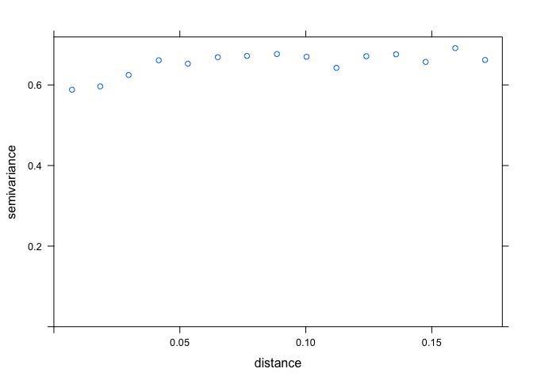<!-- -->

``` r
dfit <- fit.variogram(dvgm, model=vgm(0.01, "Mat", 0.03, 0.1)) # fit model
dfit
```

    ##   model     psill      range kappa
    ## 1   Nug 0.5658790 0.00000000   0.0
    ## 2   Mat 0.1146055 0.03840529   0.5

``` r
plot(dvgm,dfit)
```

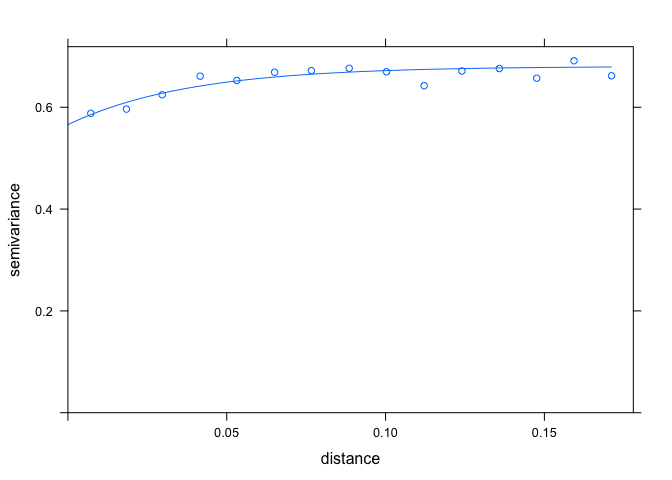<!-- -->

### Kriging

``` r
#kriging
coordinates(testdata) <- ~ LON + LAT 

dkriged <- krige(resid~1, traindata, testdata, model=dfit)
```

    ## [using ordinary kriging]

### Plot

``` r
dk=as.data.frame(dkriged)
dk %>% head
```

    ##        LON      LAT     var1.pred  var1.var
    ## 1 128.1197 35.14738 -0.0204186161 0.6129789
    ## 2 128.1057 35.14411 -0.0008661059 0.6143837
    ## 3 128.1046 35.14563  0.0108165035 0.6156086
    ## 4 128.1156 35.14881  0.0016032743 0.6142627
    ## 5 128.1094 35.16630  0.1199356260 0.6226687
    ## 6 128.1066 35.16325  0.1053337418 0.6235877

``` r
#plot kriging image
testdat=as.data.frame(testdata)

testdat$pred.resid=dk$var1.pred

testdat$pred.reg=exp(predict(fit,newdata=testdat))
testdat$pred.reg1=predict(fit,newdata=testdat)

test.dat=merge(testdat,dk,by=c("LON","LAT"))

test.dat$pred.val=exp(test.dat$pred.resid+test.dat$pred.reg1)

plot1=ggmap(myMap)+geom_point(aes(x = LON, y = LAT, colour=pred.val), 
                              data = test.dat, alpha = .8, size = 0.5) + coord_equal() + 
  ggtitle("Predicted value") + theme(plot.title = element_text(hjust = 0.5)) + 
  scale_colour_continuous(low = "skyblue",high="red",name="Pred. value")
```

    ## Coordinate system already present. Adding new coordinate system, which will replace the existing one.

``` r
plot1
```

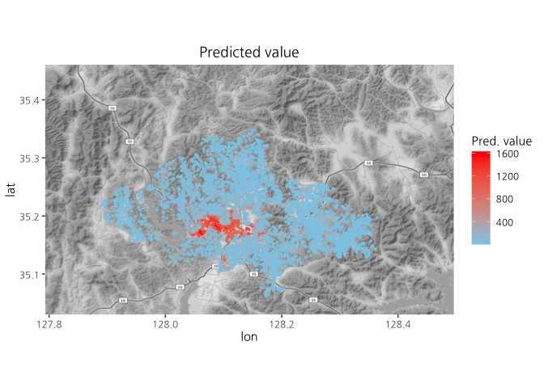<!-- -->

``` r
plot2=ggmap(myMap)+geom_point(aes(x = LON, y = LAT, color=var1.var), 
                              data = test.dat, alpha = .8, size = 0.5) + coord_equal() + 
  ggtitle("Predicted variance") + theme(plot.title = element_text(hjust = 0.5)) + 
  scale_colour_continuous(low = "skyblue",high="red",name="Pred. Var")
```

    ## Coordinate system already present. Adding new coordinate system, which will replace the existing one.

``` r
plot2
```

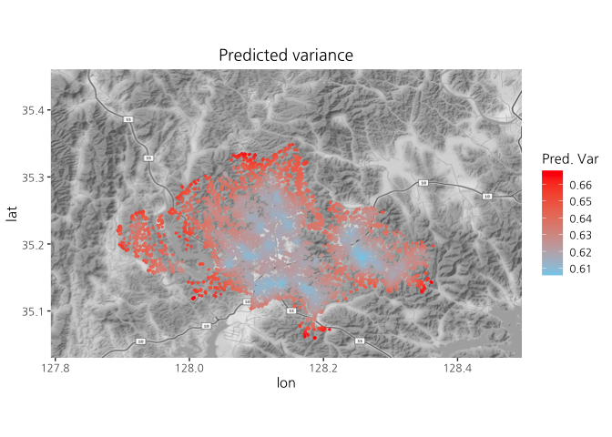<!-- -->

``` r
area1 <- readOGR("emd(shp)/TL_SCCO_EMD.shp")
```

    ## OGR data source with driver: ESRI Shapefile 
    ## Source: "/Users/hyanggonjin/Downloads/spatial/emd(shp)/TL_SCCO_EMD.shp", layer: "TL_SCCO_EMD"
    ## with 5039 features
    ## It has 3 fields

``` r
area1 <- subset(area1, subset = (substr(area1$EMD_CD,1,4) == "4817"))
area11<-fortify(area1, region = "EMD_CD")
area12<-subset(area11,subset=area11$id <= 48170137 )
area12$id<-gsub(" ","",paste(area12$id,"00"))

area2 <- readOGR("li(shp)/TL_SCCO_LI.shp")
```

    ## OGR data source with driver: ESRI Shapefile 
    ## Source: "/Users/hyanggonjin/Downloads/spatial/li(shp)/TL_SCCO_LI.shp", layer: "TL_SCCO_LI"
    ## with 15178 features
    ## It has 3 fields

``` r
area2 <- subset(area2, subset = (substr(area2$LI_CD,1,4) == "4817"))
area22=fortify(area2, region = "LI_CD")
```

    ## SpP is invalid

``` r
area3=rbind(area12,area22)

avg.mean=aggregate(pred.val~id,test.dat,mean)
dat=merge(avg.mean,area3,by="id")

ggplot(data = dat, aes(x = long, y = lat, group = id))+
  geom_polygon(aes(fill = dat$pred.val),colour="black")+ theme_bw() + geom_path() +
  scale_fill_continuous(low="lightskyblue", high ="red",name="Average value")
```

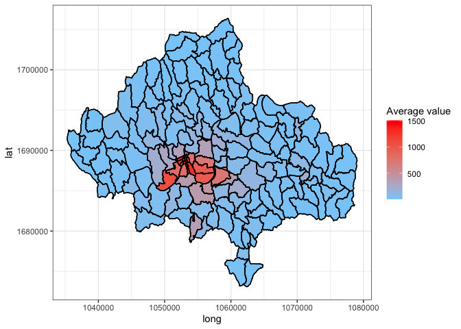<!-- -->

``` r
dat=merge(aggregate(pred.val~id,test.dat,median),area3,by="id")
cutpoint=cut(dat$pred.val,breaks=c(6,26,43,136,1524))
dat$grp=as.factor(cutpoint)

ggplot(data = dat, aes(x = long, y = lat, group = id))+
  geom_polygon(aes(fill = grp),colour="black") + 
  scale_fill_manual(values=c('steelblue','white','white','firebrick'),
                    name="Pred. value") + theme_bw() + geom_path() +
  ggtitle("") + theme(plot.title = element_text(hjust = 0.5,size=15))
```

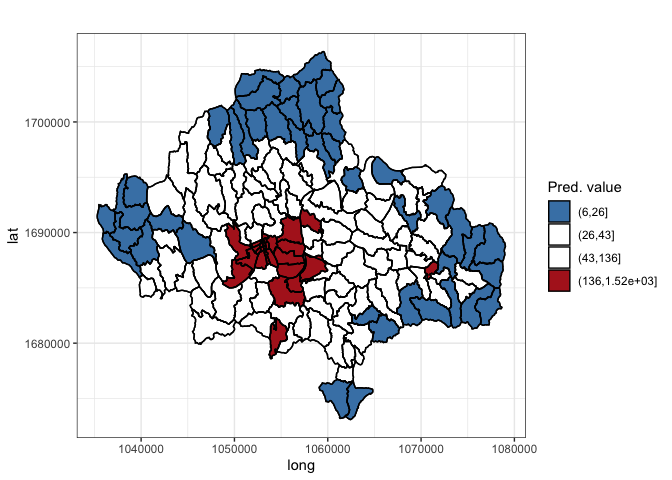<!-- -->
